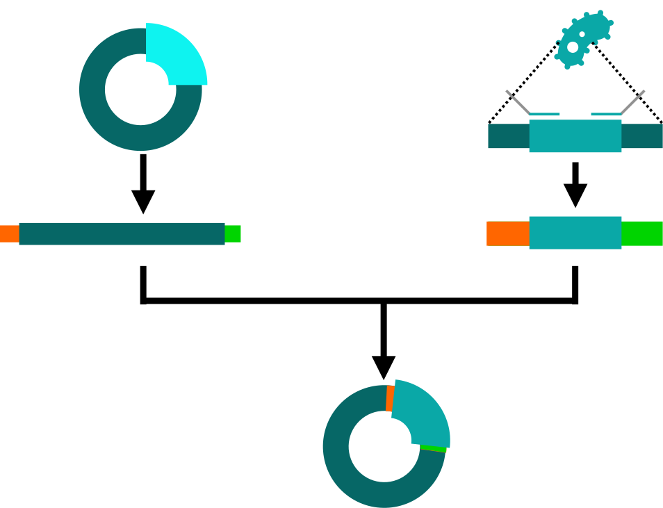
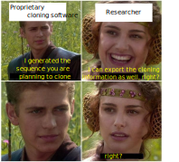
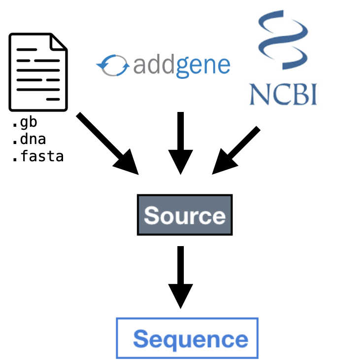
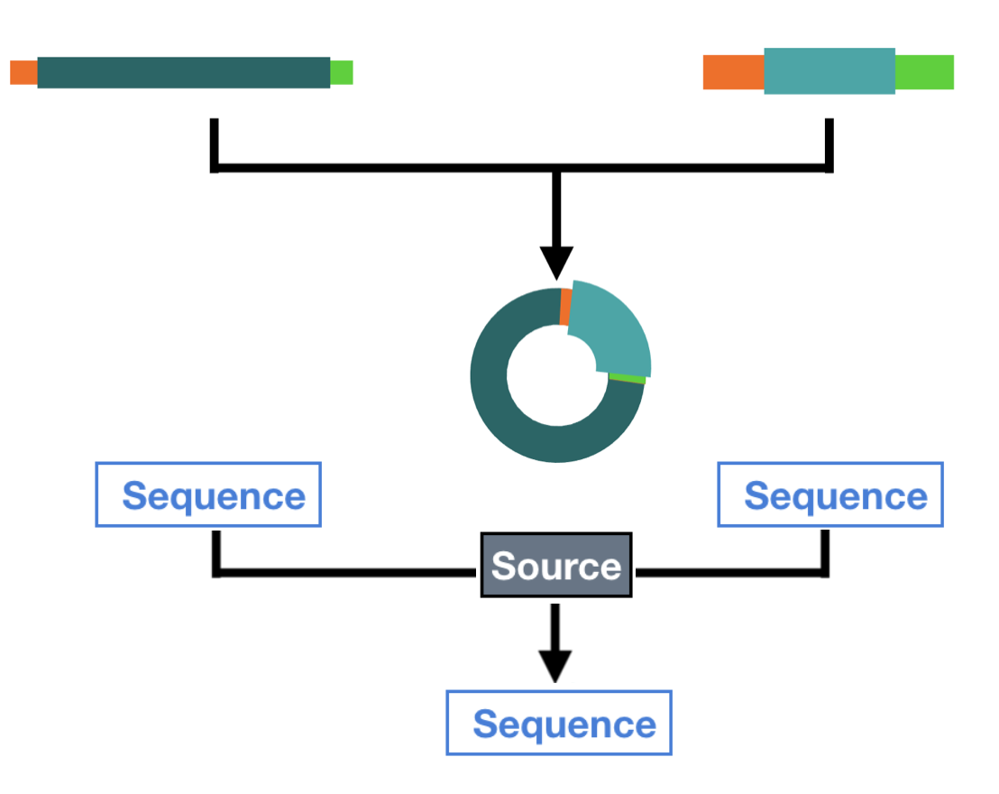
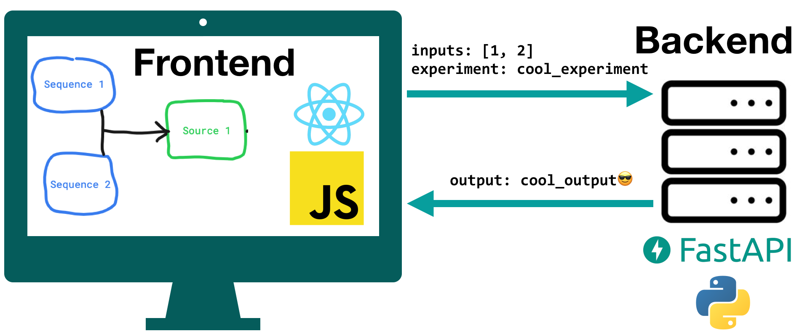
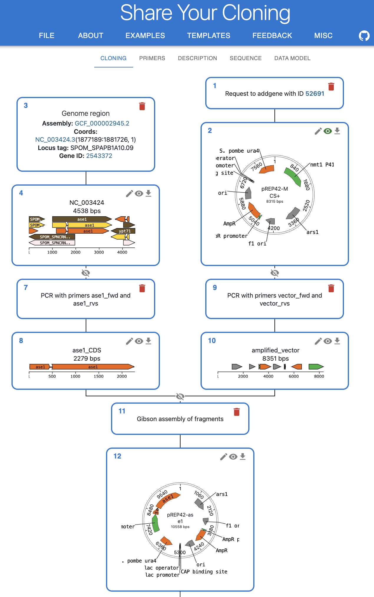

# 😥 The problem 😥

We can describe sequence features in open formats (such as `.gb`), but not cloning strategies.

Let's imagine a typical strategy to clone a gene into a plasmid through Gibson assembly:

    

🤔 There must be an Open Standard to represent this, since it is routinely done in **hundreds of laboratories**.

    

😔

 No standards means no way to automate tasks or design tools 

😔

# 🧙 The solution 🧙

## 🤖 A data model to represent cloning strategies

Every Sequence comes from a Source representing:

    

        
 a) An external import

        

            
        

    

    

        
 b) A cloning step

        

            
        

    

## 🤩 An amazing Open Source web application

Enter 🔥🔥 **ShareYourCloning** 🔥🔥, a web application where you can simulate your cloning strategy and export it in this format to share with others or for publication.

    

## 🐍 Extending and maintaining cloning libraries

As part of the project I maintain, use and extend **pydna**, a BioPython-based library to simulate cloning.

If you are into scripting and want to automate your cloning, you might want to try it.

<pre class="text-white mx-5 p-4" style="background-color: #333;">
<code>> pip install pydna</code>
</pre>

# 🙋 Try it yourself! 🙋‍♂️

    

    
Web application

    

    
GitHub repository

    

<a href="https://shareyourcloning.org/">https://shareyourcloning.org/</a>

