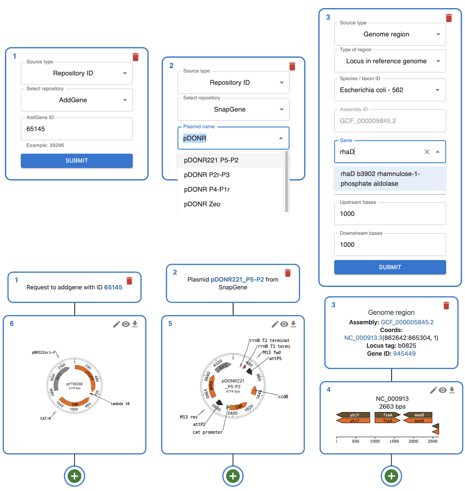
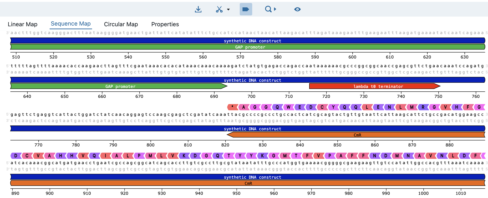
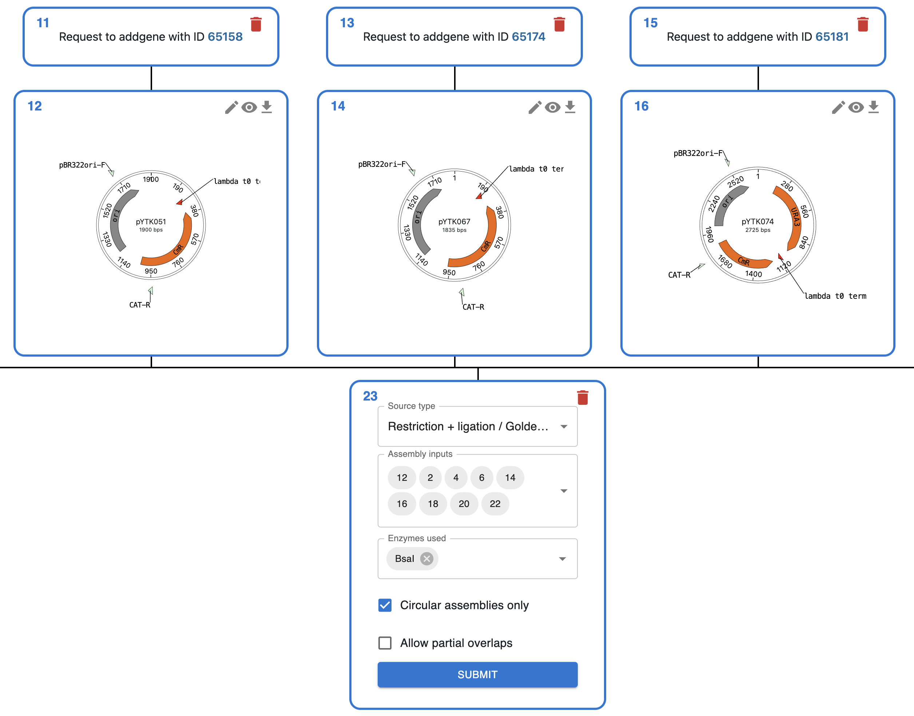
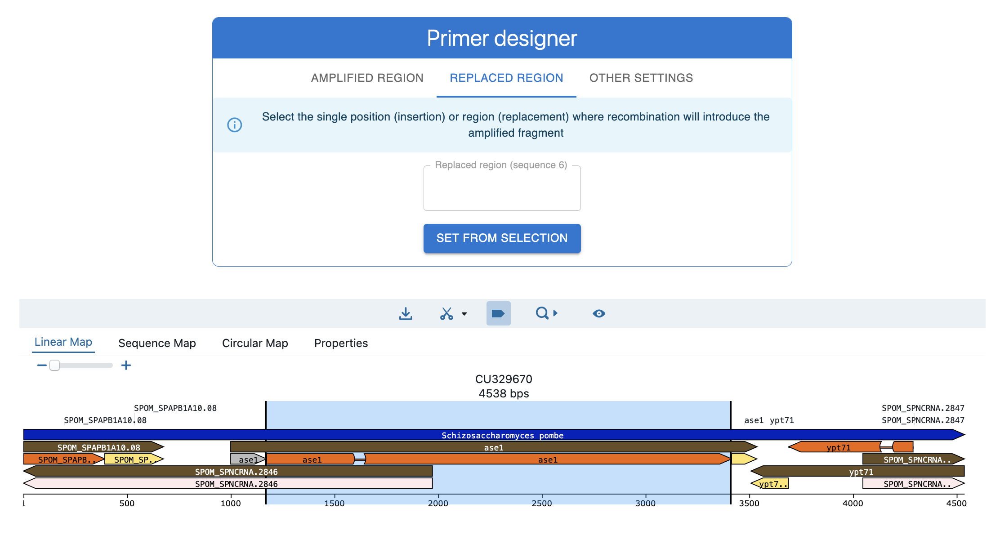
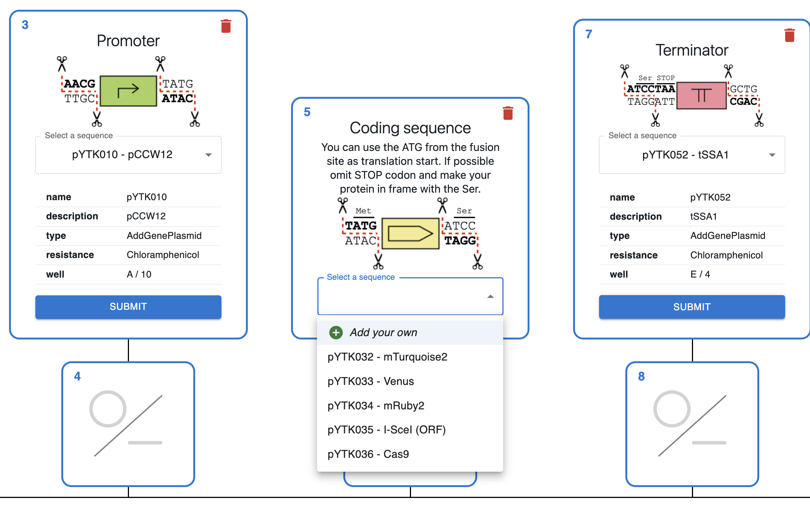

# ⬇️ Import from anywhere ⬇️

<ul style="list-style-type: none;padding-left: 0px;">
<li>💻 Local files</li>
<li>🔄 AddGene</li>
<li>💰 GenBank</li>
<li>🧬 NCBI genomes (by gene or region)</li>
<li>🧪 SnapGene website</li>
<li>🪼 Benchling link</li>
<li>🇪🇺 EuroScarf</li>
</ul>

    

# 👁️ Rich feature viewer 👁️

    

# 🧬 Techniques supported 🧬

<ul style="list-style-type: none;padding-left: 0px;">
<li>🔒 Golden Gate</li>
<li>🧩 Gibson Assembly</li>
<li>✂️ Restriction - ligation</li>
<li>🔄 PCR</li>
<li>🔀 Hom. Recombination</li>
<li>🦠 CRISPR-HDR</li>
<li>🔄 Overlap extension PCR</li>
<li>⛩️ Gateway™</li>
<li>➡️ Polymerase extension</li>
<li>🧬 Oligo hybridization</li>
</ul>

    

# 🧪 Primer design 🧪

<ul style="list-style-type: none;padding-left: 0px;">
<li>🧩 Gibson Assembly</li>
<li>🔀 Hom. Recombination</li>
<li>🦠 CRISPR-HDR</li>
<li>✂️ Restriction - ligation</li>
<li>🔄 Checking PCR</li>
</ul>

    

# 🧰 Cloning kit templates 🧰

    

  
It's very easy to create your own templates in Excel!

  

# 🔮 Coming soon 🔮

* 🔍 **Private sequence database for your lab** 🔍
  * Ancestry and progeny of all resources.
  * Rich queries:
    * Alleles of a certain gene
    * Plasmids with a given marker
* 🧫 **Strain and cell line support** 🧫
  * Genotypes as arrays of alleles.
  * Alleles as cloning strategies starting from wt locus.
* 🤖 **Better automation support** 🤖
  * Generate the same output using a pydna script.
* 📓⚙️ **Integration with e-lab notebooks** ⚙️📓
  * eLabFTW and LabID (EMBL).
* 📎 **Attach supporting evidence** 📎
  * Gel images
  * Sequencing data (auto-aligned).

* 📜📩**One Click Export/Report/Share/Publish**📩📜
  * Generate "Materials and Methods" text and files.
  * Generate publisher-specific tables (e.g., STAR).
  * Submit to repositories and generate unique IDs.

